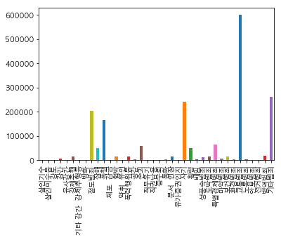
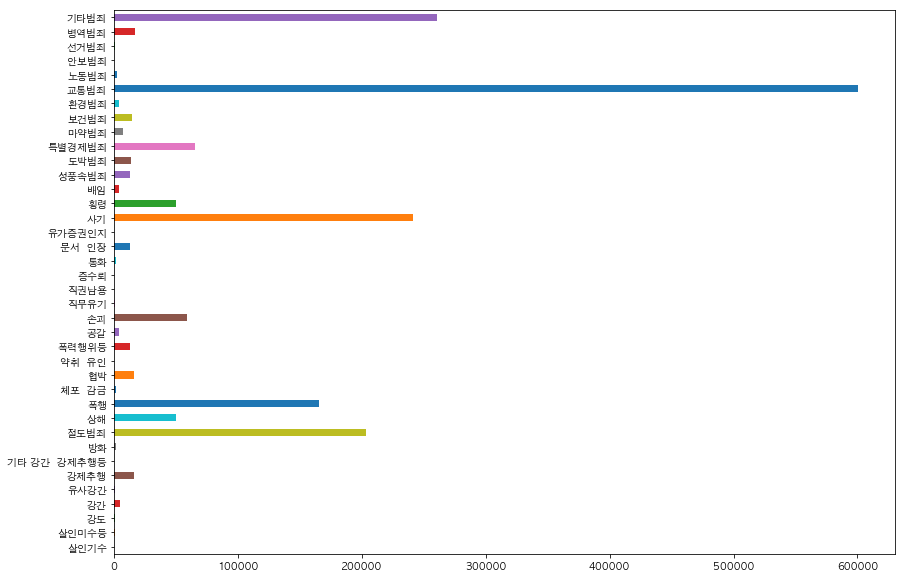
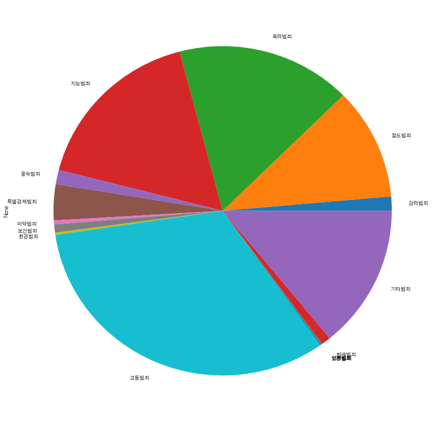
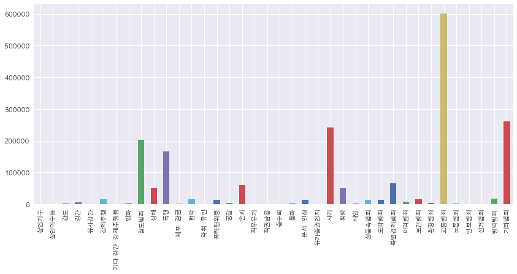
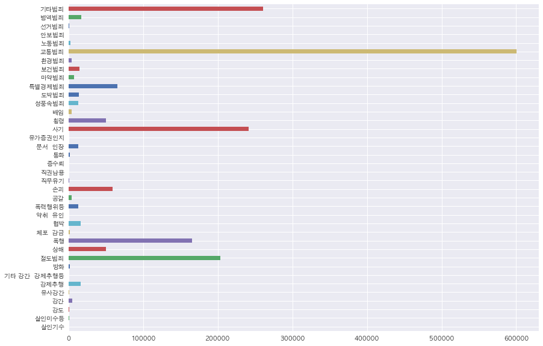
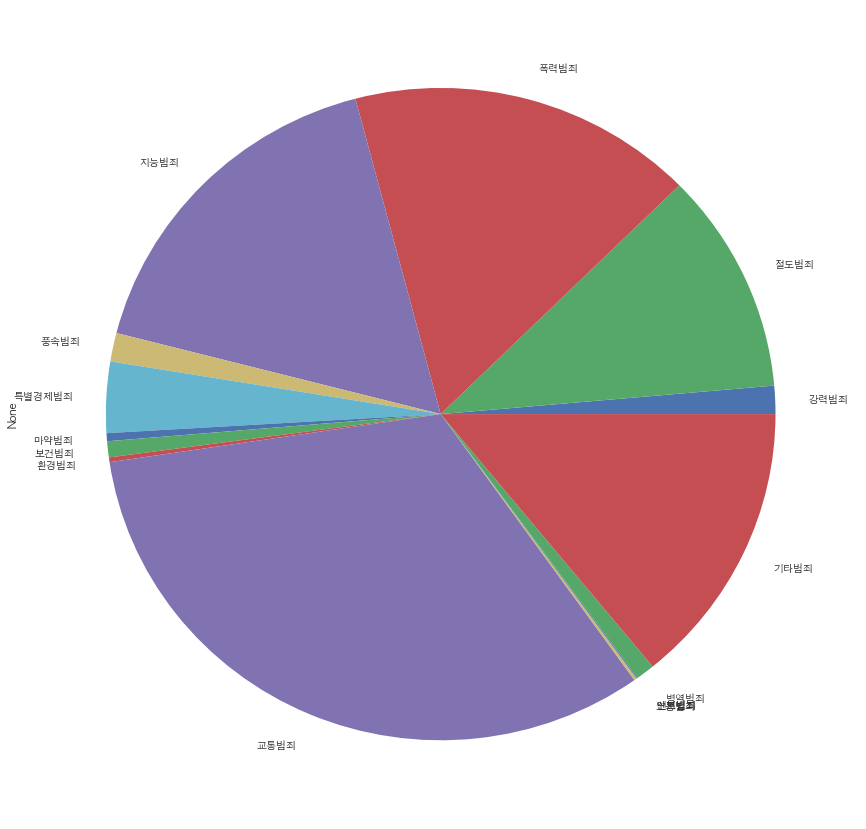

# Industry 4.0 의 중심, BigData

<div align='right'><font size=2 color='gray'>Data Processing Based Python @ <font color='blue'><a href='https://www.facebook.com/jskim.kr'>FB / jskim.kr</a></font>, 김진수</font></div>
<hr>

## <font color='brown'> 공공데이터 활용 </font>

### Case2. 2016범죄 발생 유형별 분석
>  
- [범죄통계] 범죄발생지 (지역별)
- http://www.data.go.kr/dataset/3074462/fileData.do;jsessionid=wIXUEwb7u5qgTUblcWd1qSq-.node20


```python
import platform

from pandas import Series, DataFrame
import pandas as pd
import numpy as np
import matplotlib.pyplot as plt

from matplotlib import font_manager, rc
if platform.system() == 'Darwin':
    rc('font', family='AppleGothic')
elif platform.system() == 'Windows':
    font_name = font_manager.FontProperties(fname="C:/Windows/Fonts/malgun.ttf").get_name()
    rc('font', family=font_name)
else:
    print("It's unknown system. Hangul fonts are not supported!")
    
# plt.rcParams['axes.unicode_minus'] = False
plt.rcParams["figure.figsize"] = [20,12]

%matplotlib inline
```


```python
df = pd.read_csv('data/public_2016_crime_st.csv', encoding='EUC-KR')
df.head()
```


<div>
<style scoped>
    .dataframe tbody tr th:only-of-type {
        vertical-align: middle;
    }

    .dataframe tbody tr th {
        vertical-align: top;
    }

    .dataframe thead th {
        text-align: right;
    }
</style>
<table border="1" class="dataframe">
  <thead>
    <tr style="text-align: right;">
      <th></th>
      <th>범죄대분류</th>
      <th>범죄중분류</th>
      <th>계</th>
      <th>서울</th>
      <th>부산</th>
      <th>대구</th>
      <th>인천</th>
      <th>광주</th>
      <th>대전</th>
      <th>울산</th>
      <th>...</th>
      <th>경남 밀양</th>
      <th>경남 사천</th>
      <th>경남 양산</th>
      <th>경남 진주</th>
      <th>경남 창원</th>
      <th>경남 통영</th>
      <th>제주 서귀포</th>
      <th>제주 제주</th>
      <th>기타도시</th>
      <th>도시이외</th>
    </tr>
  </thead>
  <tbody>
    <tr>
      <th>0</th>
      <td>강력범죄</td>
      <td>살인기수</td>
      <td>356</td>
      <td>46</td>
      <td>29</td>
      <td>17</td>
      <td>20</td>
      <td>9</td>
      <td>16</td>
      <td>7</td>
      <td>...</td>
      <td>2</td>
      <td>-</td>
      <td>3</td>
      <td>2</td>
      <td>3</td>
      <td>-</td>
      <td>-</td>
      <td>4</td>
      <td>2</td>
      <td>51</td>
    </tr>
    <tr>
      <th>1</th>
      <td>강력범죄</td>
      <td>살인미수등</td>
      <td>558</td>
      <td>100</td>
      <td>43</td>
      <td>12</td>
      <td>28</td>
      <td>8</td>
      <td>9</td>
      <td>15</td>
      <td>...</td>
      <td>-</td>
      <td>3</td>
      <td>1</td>
      <td>3</td>
      <td>15</td>
      <td>3</td>
      <td>1</td>
      <td>11</td>
      <td>2</td>
      <td>49</td>
    </tr>
    <tr>
      <th>2</th>
      <td>강력범죄</td>
      <td>강도</td>
      <td>1,149</td>
      <td>260</td>
      <td>137</td>
      <td>51</td>
      <td>88</td>
      <td>47</td>
      <td>35</td>
      <td>33</td>
      <td>...</td>
      <td>4</td>
      <td>1</td>
      <td>7</td>
      <td>6</td>
      <td>26</td>
      <td>1</td>
      <td>1</td>
      <td>24</td>
      <td>1</td>
      <td>46</td>
    </tr>
    <tr>
      <th>3</th>
      <td>강력범죄</td>
      <td>강간</td>
      <td>5,155</td>
      <td>1,129</td>
      <td>314</td>
      <td>197</td>
      <td>347</td>
      <td>170</td>
      <td>171</td>
      <td>112</td>
      <td>...</td>
      <td>8</td>
      <td>5</td>
      <td>31</td>
      <td>32</td>
      <td>68</td>
      <td>15</td>
      <td>16</td>
      <td>68</td>
      <td>11</td>
      <td>366</td>
    </tr>
    <tr>
      <th>4</th>
      <td>강력범죄</td>
      <td>유사강간</td>
      <td>583</td>
      <td>123</td>
      <td>28</td>
      <td>37</td>
      <td>47</td>
      <td>21</td>
      <td>14</td>
      <td>16</td>
      <td>...</td>
      <td>-</td>
      <td>2</td>
      <td>4</td>
      <td>1</td>
      <td>7</td>
      <td>1</td>
      <td>3</td>
      <td>13</td>
      <td>-</td>
      <td>33</td>
    </tr>
  </tbody>
</table>
<p>5 rows × 90 columns</p>
</div>


```python
df['범죄대분류']
```


    0       강력범죄
    1       강력범죄
    2       강력범죄
    3       강력범죄
    4       강력범죄
    5       강력범죄
    6       강력범죄
    7       강력범죄
    8       절도범죄
    9       폭력범죄
    10      폭력범죄
    11      폭력범죄
    12      폭력범죄
    13      폭력범죄
    14      폭력범죄
    15      폭력범죄
    16      폭력범죄
    17      지능범죄
    18      지능범죄
    19      지능범죄
    20      지능범죄
    21      지능범죄
    22      지능범죄
    23      지능범죄
    24      지능범죄
    25      지능범죄
    26      풍속범죄
    27      풍속범죄
    28    특별경제범죄
    29      마약범죄
    30      보건범죄
    31      환경범죄
    32      교통범죄
    33      노동범죄
    34      안보범죄
    35      선거범죄
    36      병역범죄
    37      기타범죄
    Name: 범죄대분류, dtype: object


```python
df['범죄중분류']
```


    0             살인기수
    1            살인미수등
    2               강도
    3               강간
    4             유사강간
    5             강제추행
    6     기타 강간  강제추행등
    7               방화
    8             절도범죄
    9               상해
    10              폭행
    11          체포  감금
    12              협박
    13          약취  유인
    14           폭력행위등
    15              공갈
    16              손괴
    17            직무유기
    18            직권남용
    19             증수뢰
    20              통화
    21          문서  인장
    22          유가증권인지
    23              사기
    24              횡령
    25              배임
    26           성풍속범죄
    27            도박범죄
    28          특별경제범죄
    29            마약범죄
    30            보건범죄
    31            환경범죄
    32            교통범죄
    33            노동범죄
    34            안보범죄
    35            선거범죄
    36            병역범죄
    37            기타범죄
    Name: 범죄중분류, dtype: object


#### <font color='blue'> # 범죄중분류 별 건수 </font>


```python
df_index = pd.Series(df['계'].values, index=df['범죄중분류'].values)
df_index
```


    살인기수                356
    살인미수등               558
    강도                1,149
    강간                5,155
    유사강간                583
    강제추행             16,054
    기타 강간  강제추행등        408
    방화                1,502
    절도범죄            203,037
    상해               50,028
    폭행              165,803
    체포  감금            1,318
    협박               15,870
    약취  유인              201
    폭력행위등            13,302
    공갈                3,745
    손괴               59,127
    직무유기                531
    직권남용                437
    증수뢰                 260
    통화                1,811
    문서  인장           13,295
    유가증권인지              219
    사기              241,613
    횡령               50,053
    배임                4,358
    성풍속범죄            12,719
    도박범죄             13,446
    특별경제범죄           65,025
    마약범죄              7,329
    보건범죄             14,662
    환경범죄              4,349
    교통범죄            600,401
    노동범죄              2,457
    안보범죄                 81
    선거범죄              1,018
    병역범죄             16,651
    기타범죄            260,539
    dtype: object


```python
df_index.values
```


    array(['356', '558', '1,149', '5,155', '583', '16,054', '408', '1,502',
           '203,037', '50,028', '165,803', '1,318', '15,870', '201', '13,302',
           '3,745', '59,127', '531', '437', '260', '1,811', '13,295', '219',
           '241,613', '50,053', '4,358', '12,719', '13,446', '65,025',
           '7,329', '14,662', '4,349', '600,401', '2,457', '81', '1,018',
           '16,651', '260,539'], dtype=object)


<font color='green'> 
> [Note] 
* 값안에 콤마(,)가 있다는 의미는 숫자가 아니라 문자란 말이다. 
* 따라서 그대로 하면 연산이 안된다. 변환이 필요하다.


```python
df_index.values[2]
```


    '1,149'


```python
int(df_index.values[2].replace(',', ''))
```


    1149


#### <font color='blue'> # 문자열을 정수형으로 변환 </font>


```python
for n in np.arange(len(df_index)):
    df_index.values[n] = int(df_index.values[n].replace(',', ''))
```


```python
df_index.values
```


    array([356, 558, 1149, 5155, 583, 16054, 408, 1502, 203037, 50028, 165803,
           1318, 15870, 201, 13302, 3745, 59127, 531, 437, 260, 1811, 13295,
           219, 241613, 50053, 4358, 12719, 13446, 65025, 7329, 14662, 4349,
           600401, 2457, 81, 1018, 16651, 260539], dtype=object)


```python
df_index.plot(kind='bar')
```


    <matplotlib.axes._subplots.AxesSubplot at 0x10c605f60>





```python
plt.rcParams["figure.figsize"] = [14,10]
df_index.plot(kind='barh')
```


    <matplotlib.axes._subplots.AxesSubplot at 0x117c875c0>





#### <font color='blue'> # 범죄대분류 별 건수 </font>


```python
df_crime = pd.Series(df['계'].values, index=df['범죄대분류'].values)
df_crime
```


    강력범죄         356
    강력범죄         558
    강력범죄        1149
    강력범죄        5155
    강력범죄         583
    강력범죄       16054
    강력범죄         408
    강력범죄        1502
    절도범죄      203037
    폭력범죄       50028
    폭력범죄      165803
    폭력범죄        1318
    폭력범죄       15870
    폭력범죄         201
    폭력범죄       13302
    폭력범죄        3745
    폭력범죄       59127
    지능범죄         531
    지능범죄         437
    지능범죄         260
    지능범죄        1811
    지능범죄       13295
    지능범죄         219
    지능범죄      241613
    지능범죄       50053
    지능범죄        4358
    풍속범죄       12719
    풍속범죄       13446
    특별경제범죄     65025
    마약범죄        7329
    보건범죄       14662
    환경범죄        4349
    교통범죄      600401
    노동범죄        2457
    안보범죄          81
    선거범죄        1018
    병역범죄       16651
    기타범죄      260539
    dtype: object


```python
def get_crime_cnt(d_frame):
    crime_cnt = {}
    for idx in range(len(d_frame.index)):
        # print(idx, d_frame.index[idx], d_frame[idx], end="  \t =>")
        # print(idx, crime_cnt)

        crime = d_frame.index[idx]
        count  = d_frame[idx]

        if crime_cnt.get(crime):
            crime_cnt[crime] += count
        else:
            crime_cnt[crime] = count
    
    return crime_cnt
    
crime_dict = get_crime_cnt(df_crime)
crime_dict
```


    {'강력범죄': 25765,
     '절도범죄': 203037,
     '폭력범죄': 309394,
     '지능범죄': 312577,
     '풍속범죄': 26165,
     '특별경제범죄': 65025,
     '마약범죄': 7329,
     '보건범죄': 14662,
     '환경범죄': 4349,
     '교통범죄': 600401,
     '노동범죄': 2457,
     '안보범죄': 81,
     '선거범죄': 1018,
     '병역범죄': 16651,
     '기타범죄': 260539}


```python
crime_stat = Series(crime_dict)
crime_stat
```


    강력범죄       25765
    절도범죄      203037
    폭력범죄      309394
    지능범죄      312577
    풍속범죄       26165
    특별경제범죄     65025
    마약범죄        7329
    보건범죄       14662
    환경범죄        4349
    교통범죄      600401
    노동범죄        2457
    안보범죄          81
    선거범죄        1018
    병역범죄       16651
    기타범죄      260539
    dtype: int64


```python
plt.rcParams["figure.figsize"] = [15,15]
crime_stat.plot(kind='pie')
```


    <matplotlib.axes._subplots.AxesSubplot at 0x108512128>





#### <font color='blue'> # Seaborn을 사용한 데이터 시각화 </font>
> 
- Matplotlib을 기반으로 다양한 색상 테마와 통계용 챠트 등의 기능을 추가한 시각화 패키지 
- http://seaborn.pydata.org/index.html


```python
import seaborn as sns
sns.set()

if platform.system() == 'Darwin':
    rc('font', family='AppleGothic')
elif platform.system() == 'Windows':
    font_name = font_manager.FontProperties(fname="C:/Windows/Fonts/malgun.ttf").get_name()
    rc('font', family=font_name)
else:
    print("It's unknown system. Hangul fonts are not supported!")
```


```python
plt.rcParams["figure.figsize"] = [14,6]
df_index.plot(kind='bar')
```


    <matplotlib.axes._subplots.AxesSubplot at 0x1a1ade7e10>





```python
plt.rcParams["figure.figsize"] = [14,10]
df_index.plot(kind='barh')
```


    <matplotlib.axes._subplots.AxesSubplot at 0x1a1af1edd8>





```python
df_index.sort_values(ascending=False).head(10)
```


    교통범죄      600401
    기타범죄      260539
    사기        241613
    절도범죄      203037
    폭행        165803
    특별경제범죄     65025
    손괴         59127
    횡령         50053
    상해         50028
    병역범죄       16651
    dtype: object


```python
plt.rcParams["figure.figsize"] = [15,15]
crime_stat.plot(kind='pie')
```


    <matplotlib.axes._subplots.AxesSubplot at 0x1a1aeeaf98>





<hr>
<marquee><font size=3 color='brown'>The BigpyCraft find the information to design valuable society with Technology & Craft.</font></marquee>
<div align='right'><font size=2 color='gray'> &lt; The End &gt; </font></div>
